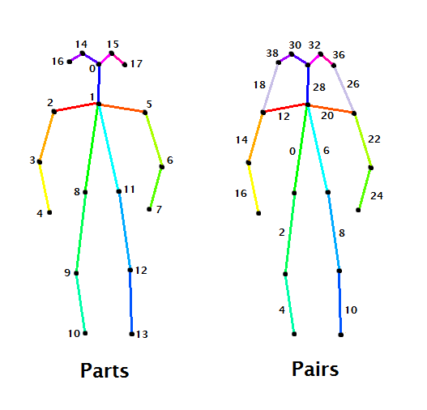
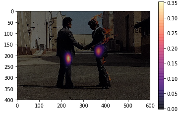
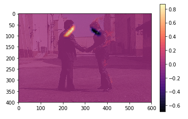
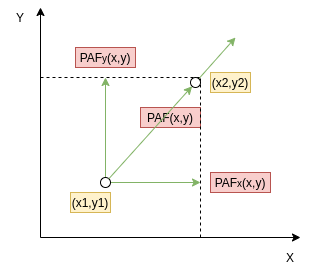
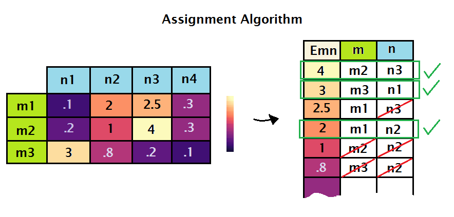
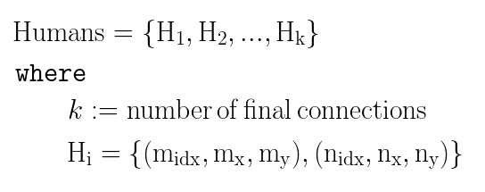
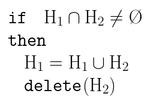

<p style="text-align: center;"><h1> Tìm hiểu framwork OpenPose TensorFlow </h1></p>
<hr>

### OpenPose Overview
<hr>

- OpenPose là một thư viện để dò tìm các bộ phận trên cơ thể người và chạy được đa luồng.
- OpenPose được viết bằng ngôn ngữ C++ sử dụng OpenCv và Caffe
- OpenPose được xây dựng dựa trên mạng neural network và đã được phát triển bởi đại học Carnegie Mellon, sử dụng bộ dữ liệu COCO và MPII
- OpenPose đã được chuyển đổi để sử dụng cùng với Tensorflow, điều này làm cho framework này được sử dụng ngày càng rộng rãi hơn 

### OpenPose Pineline
<hr>


### Parts and Pairs
<hr>

- Mặc dù 2 từ này nghe có vẻ giống nhau, tuy nhiên chúng khác nhau hoàn toàn
    + `Part` chỉ một bộ phận trên cơ thể con người (cổ, vai, tay, chân,..)
    + `Pair` là một cặp **Part** và giữa cặp **Part** đó có sự liên kết. Tuy nhiên có những cặp thì sự liên kết sẽ không tồn tại (ví dụ như giữa tai và vai)  
- Hình minh họa:


<!--  -->

### Neural Network
<hr>

- Đây chính là phần quan trọng nhất của OpenPose. Nó được ví von nhuw một phần bí ẩn để làm máy bay có thể bay hoặc làm cho smartphone hoạt động. Chúng ta sẽ xem nó như là một hộp đen

- Thao tác cuối cùng của mạng neural network sẽ trả về một tensor chứa 57 ma trận. Tuy nhiên thao tác cuối cùng này thì chỉ là việc kết kết hợp lại của 2 tensors khác là `heatmap` và `PAF`. Vậy nên việc hiểu được 2 tensors này là điều cơ bản
    1. **Heatmap**
        + Một *heatmap* là một ma trận lưu lại độ tin cậy của một mạng mà một pixel cụ thể sẽ chứa một *part* cụ thể. 
        + Chúng ta sẽ có 18 heatmaps tương ứng với mỗi phần trên cơ thể người và được đánh số như hình ở trên. 
        + Việc của chúng ta là phải lấy ra được vị trí của các phần cơ thể người từ 18 ma trận đó
        
    2. **PAF (Part Affinity Fields)**
        + PAF là những ma trận sẽ cho chúng ta những thông itn về hướng của các cặp (pairs).
        + Chúng đi theo cặp, với mỗi phần trên cơ thể người ta sẽ có một `PAF cho X` và một `PAF cho Y`.
        + Chúng ta sẽ có `38 PAFs` tương ứng với mỗi cặp và được đánh chỉ số như hình ở trên
        + Việc ghép các parts thành các pairs sẽ dựa vào 38 ma trận này
        

### Non-Maximum Suppression
<hr>

- Bước tiếp theo chúng ta cần thực hiện là tìm ra được các `parts` ở trong image. Heatmap đã giúp chúng ta khá tốt, tuy nhiên ta cần sự chắc chắn hơn là sự tin cậy (`confidence` vs `certainly`). Và kỹ thuật được sử dụng là ***non-maximum suppression***

- **Các bước thực hiện của thuật toán:** 
    1. Bắt đầu ở pixel đầu tiên của heatmap
    2. Bao quanh pixel này cùng với một cửa sổ có kích thước là 5 và tìm giá trị lớn nhất ở trong cửa sổ đó
    3. Thay thế giá trị trung tâm cùng giá trị lớn nhất đó
    4. Trượt cửa sổ đi 1 pixel và lặp lại các bước bên trên cho tới khi bao phủ hết heatmap
    5. So sánh kết quả cùng với heatmap ban đầu. Những pixel nào giữ nguyên giá trị thì đó là các pixel ta cần tìm kiếm. Loại bỏ các pixel còn lại bằng việc set giá trị 0
- Sau tất cả các quá trình thì những pixel mang giá trị khác 0 sẽ là vị trí của các `part candidates`

### Bipartite graph
<hr>

- Sau bước ***Non-Maximum Suppression*** thì với mỗi `part` ở trên cơ thể thì ta sẽ có các `candidates` tương ứng. Chúng ta cần phải connect giữa các `parts` với nhau để tạo thành các `pairs`. Và đến đây thì ta cần phải dùng đến các kiến thức của đồ thị và cụ thể là đồ thị 2 phía.

- Giả sử chúng ta có một tập **m** các `candidates of necks (cổ )` và một tập **n** các `candidates of right hip (hông phải)`. Với mỗi `necks` thì chúng ta sẽ có n connections có thẻ tới `right hip` và ngược lại. Vì vậy hình dung là ta sẽ có một đồ thị đầy đủ hai phía (complete bipartite graph). Với đồ thị này thì ta có các đỉnh là các `part candidates` và các cạnh là các `connection candidates`

|  |
|:--:| 
| *Complete Bipartite Graph* |

- Vấn đề hiện tại là chúng ra phải tìm ra được liên kết chính xác. Việc tìm liên kết tốt nhất được xem là một vấn đề phổ biến ở trong đồ thị và được biết là bài toán phân chia công việc, mà để giải quyết được thì mỗi cạnh trong đồ thị phải có một `weight`
- Bài toán phân chia công việc ([assignment problem - wikipedia](https://en.wikipedia.org/wiki/Assignment_problem)):
    + Cho trước số lượng `tác tử ` và số lượng `công việc`, bất kỳ `tác tử ` nào đều có thể nhận `công việc` và mỗi cặp `tác tử -công việc` sẽ có một chi phí khác nhau với từng cặp cụ thể . 
    + Nhiệm vụ đặt ra là làm sao để phân chia được nhiều công việc nhất và chi phí ít nhất
- Áp dụng bài toán trên vào việc chọn `connections` và để thực hiện được thì mỗi cạnh sẽ phải có trọng số. 
- Chúng ta sẽ thêm `weight` cho các cạnh ở bước tiếp theo

### Line Integral
<hr>

|  |
|:-:|
| ***Line Integrall with PAFs***|


- Đến đây để có thể gán weight cho các cạnh thì ta cần dùng đến `PAFs`. 
- Việc tính weight sẽ bằng cách tính tích phân đường dọc theo đoạn thẳng nối giữa các cặp parts với nhau và theo các trục x và y tương ứng

  

- Việc tính tích phân sẽ cho mỗi liên kết một `score` và sẽ được lưu ở trong đồ thị.
- Bài toán lựa chọn liên kết sẽ được giải quyết 

### Assigment
<hr>

- Đồ thị đầy đủ 2 phía ở trên đã chỉ ra tất cả `connections` có thể giữa các `candidates` và có một trọng số tương ứng với mỗi `connections`. Nhiệm vụ của chúng ta là phải tìm các `connections` sao cho tối hóa tổng trọng số đó.
- Cách thực hiện: 
    1. Sắp xếp mỗi connections theo trọng số  (`weight`)
    2. Liên kết cùng với trọng số cao nhất thì được xem là một liên kết đích
    3. Xét tới liên kết khả thi tiếp theo. Nếu không có `parts` nào ở liên kết này đã xuất hiện ở liên kết đích ở bước trước thì đây cũng được chọn là một liên kết đích
    4. Lặp lại B3 cho đến khi ta hoàn thành



- Với kết quả ở trên thì ta có thể thấy có những connections sẽ không tạo thành được một cặp

### Merging
<hr>

- Bước cuối cùng là chuyển đổi những `liên kết (connections)`  đã tìm thấy thành các `khung xương (skeletons)`. Chúng ta giả sử rằng mỗi liên kết sẽ gắn với một người khác nhau, như vậy thì số luowjwng người sẽ bằng số lượng liên kết đã tìm được.
- Giả sử tập hợp người được biểu diễn: `Humans = {H1, H2, …, Hk}`. Mỗi một phần tử trong tập hợp chứa 2 `parts` và mỗi `part` sẽ chứa các thông tin về (`index of parts`, `x direction`, `y direction`)



- Tại sao chúng ta cần merging: Nếu như 2 người H1 và H2 cùng có chung `part index` và có cùng vị trí tọa độ thì họ đang có chung `part`. Vậy nên 2 người đó là 1 và ta sẽ merge họ lại với nhau.



- Chúng ta sẽ áp dụng cho mỗi một cặp người H1-H2 cho đến khi không còn cặp nào có chung `part`

### Reference
<hr>

1. [Human pose estimation using OpenPose with TensorFlow - Part2](https://arvrjourney.com/human-pose-estimation-using-openpose-with-tensorflow-part-2-e78ab9104fc8) - Ale Solano
2. [Human pose estimation using OpenPose with TensorFlow - Part1](https://arvrjourney.com/human-pose-estimation-using-openpose-with-tensorflow-part-1-7dd4ca5c8027) - Ale Solano


```python

```
